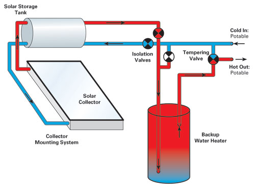
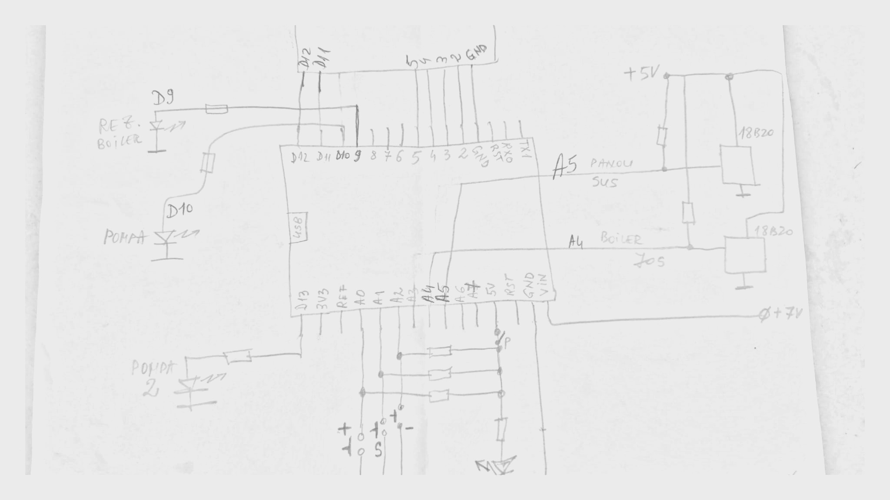

# Arduino Solar Water Heating Pump Controller

An arduino project that acts as a controller between the Solar Storage Tank and the Backup Water Heater. 

At a very high level:
1. When the temperature in the Solar Storage Tank goes below a threshold, the Backup Water Heater kicks in to take over and the pump gets the water from the backup.
2. When the temperature in the Solar Storage Tank goes above a threshold, the Backup Water Heater stops and he pump gets the water from the solar tank.

The threshold is configurable via button input. The temperature as well as the configuration is displayed on an 16x2 character LCD module.

---

